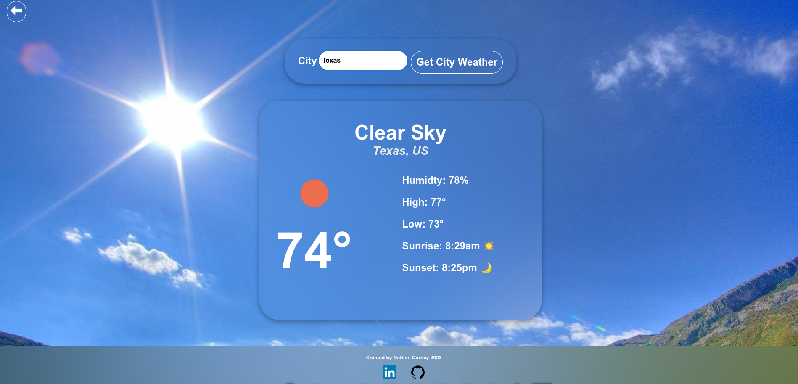

# Weather App

## Overview

The Weather App is a web application that allows users to check the current weather conditions for a specific location. Users can obtain weather information either by entering the name of a city or by providing coordinates (latitude and longitude). This app uses the OpenWeatherMap API to fetch real-time weather data.

## Features

- Get current weather information by city name or coordinates.
- Retrieve weather details such as temperature, weather description, humidity, high and low temperatures, sunrise, and sunset times.
- Display weather icons and background images based on the current weather conditions.
- Option to get the weather for the user's current location using geolocation.
- User-friendly interface with clear input options and an intuitive design.

## Usage

1. Launch the Weather App in your web browser.
2. Choose your preferred input method: either "City Name" or "Coordinates."
3. Enter the location details accordingly:
   - For "City Name," type the name of the city (e.g., "Orlando") and click the "Get City Weather" button.
   - For "Coordinates," provide the latitude and longitude (e.g., 28.54, -81.38), and click the "Get Weather" button.
4. View the weather information displayed on the screen, including the weather description, temperature, humidity, high and low temperatures, sunrise, sunset, and a weather icon.
5. Optionally, you can click the "Get Current Location" button to get weather information for your current location using geolocation.

## Technologies Used

- HTML
- CSS
- JavaScript
- [OpenWeatherMap API](https://openweathermap.org/api)

## Screenshots

See Live Version -> https://weather-app-nathan-fc88e5ad857a.herokuapp.com/

## Author

- [Nathan Carney](https://www.linkedin.com/in/nathan-carney9/)

## Repository

- [GitHub Repository](https://github.com/rundex0/WeatherApp)

